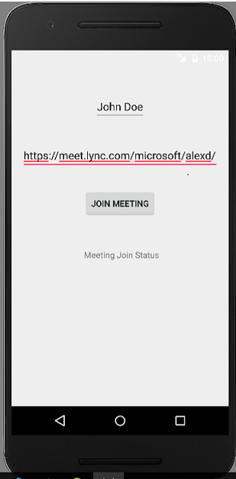
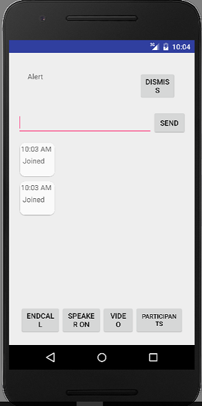

# skype-android-app-sdk-samples Guest Meeting Join sample

This sample uses the core **Skype for Business App SDK** API to
join meetings, chat, and share video. It prompts you for a join meeting URL at runtime. The sample has local references to the SDK libraries that you download to 
your development computer. 

Before you can run the Android samples in the [skype-android-app-sdk-samples](https://github.com/OfficeDev/skype-android-app-sdk-samples) repository, 
you need to have two things:

1. The **Skype for Business App SDK** libraries which you can download from [Skype for Business App SDK download](http://aka.ms/sfbappsdkdownload_android). 
2. The join meeting URL for an established **Skype for Business** meeting.

## Copy the Skype for Business App SDK libraries into the project
 
1. Clone the Guest Meeting Join sample into a local folder like _C:\android\skype-android-app-sdk-samples_.
2. Copy the SDK libraries from the downloaded SDK into your project.
  The SDK folder _SkypeForBusinessAppSDKAndroid-0.5.0.1_ is found in the download location on your 
  computer. The **Skype for Business App sdk** libraries are found in the _AppSDKAndroid_ folder. 
  Copy all of these libraries into the Guest Meeting sample project. The module _build.gradle_ 
  file already references the libraries at: _[your local repository]\GuestMeetingJoin\sfbdemo\libs_. Be sure to copy the SDK
  libraries specified. 

## Run the sample

Connect your Android phone to the development computer using a USB port. Press Shift-F10 to run the sample.  
The **Skype for Business App SDK** does not support Android Studio emulators. You need to run the sample on a 
**armeabi-v7a** mobile device. See [Platform Considerations](https://msdn.microsoft.com/en-us/skype/appsdk/platformconsiderations) for 
more information.

## The running sample

The main activity of the Guest Meeting Join app collects the name you want to display in a meeting. The second
text entry field collects the meeting URL of the meeting you want to join. Fill these fields in and then
press the Join Meeting button. **Figure 1** shows the sign in screen.

  
  
  **Figure 1. Sign in activity**

As the app starts to connect to the meeting and establishes a connection, the status of the connection is 
updated on the activity. When the meeting is established, the ConversationsActivity opens. 

The conversations activity hosts a single meeting. You can start and end conversation video, send chat messags, mute your audio,
and view a list of participants in the meeting. To start meeting video, press the video button. 

**Figure 2. Conversation activity**

## The video fragment

The meeting video is shown in two regions of the video fragment. The incoming meeting video is shown inside of a relative view container
in the upper portion of the fragment. The preview of outgoing video is shown in a **TextureView** in the lower part of the fragment. 
You can pause outgoing video or change the active device camera with the two buttons at the bottom of the fragment. 

By pressing the device back button, you pause the outgoing video but remain in the meeting. To leave the meeting, press the device 
back button from the conversation activity. You are returned to the sign in activity. Choose the **Leave Meeting** button to leave the
meeting.

## Copyright
Copyright (c) 2016 Microsoft. All rights reserved.

